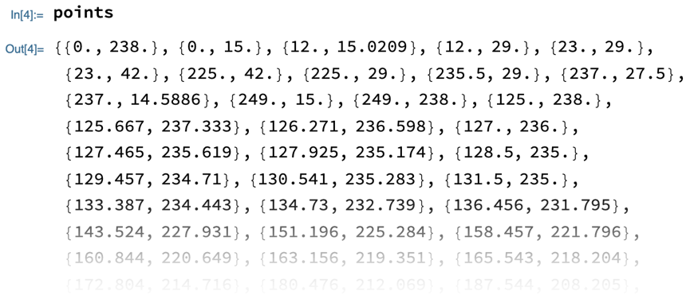

## Extracting points from an image

--- task ---

If you have never used the Wolfram Language before, follow [this guide to get started](https://projects.raspberrypi.org/en/projects/getting-started-with-mathematica) and learn to use the tool. Look at the sections **Starting Mathematica** and **Programming in Mathematica**.

--- /task ---

To start, you will convert an image to a vector graphic and extract the coordinates of the points that determine how it is drawn.

--- collapse ---
---
Title: Raster and vector graphics explained
---

There are two main types of computer image: **raster graphics** and **vector graphics**.

A raster graphic (also known as a bitmap image) is made up of a grid of fixed pixels. If you zoom in on a raster graphic, it will appear less detailed.

A vector graphic is made up of polygons defined by mathematical curves connecting points. If you zoom in on a vector graphic, it will retain its detail.


_Credit to [Darth Stabro, English Wikipedia](https://commons.wikimedia.org/w/index.php?curid=15789788)._

--- /collapse ---

--- task ---

Find an image and drag it into your notebook.
Your image should be fairly simple (just one or two block colours).

Alternatively, evaluate the following code to get an example image.

```
CloudGet["https://www.wolframcloud.com/obj/RasPi/Temple"]
```

--- /task ---

--- task ---

Give your image a name, such as `myImage`. Follow it with a semicolon (`;`) to hide the output and evaluate it.

```
myImage = <your image>;
```

--- /task ---

The image has now been assigned to the name you have chosen.

You are now going to reduce the size of your image. This will make later steps quicker to compute.

--- task ---

Use `Rasterize` to reduce your image to being about 200 or 300 pixels across.

```
Rasterize[myImage, RasterSize -> <number>];
```

--- /task ---

Your image is ready to convert to a vector graphic.

--- task --- 

Use `ImageGraphics` to convert your rasterised image to a vector graphic.
You will need to specify a number of colours (2 to 5 is recommended) and an image size (100 to 500).

```
ImageGraphics[myImage, <colour number>, ImageSize -> <size number>]
```

--- /task ---

With your image in vector graphic form, you can now extract the points that determine the polygons making it up. These will be the points in your dot-to-dot.

To do this, you can use `Part`.

--- collapse ---
---
title: Part explained
---

`Part` extracts part of an **expression**. The expression is usually some sort of data, but `Part` works on a lot of functions, too.
The part being extracted might be a single item, or it might be several items that match some pattern.

More specifically, the data is usually a list (or a list of lists) and items are extracted by their position, such as "4th item in the list".

`Part` is best understood with examples.

--- task ---

Evaluate this code to take the fourth item from a list.

```
Part[{a, b, c, d, e}, 4]
```

Evaluate this to take the third item from the second sub-list in a list of lists.

```
Part[{{a, b, c}, {d, e, f}, {g, h, i}}, 2, 3]
```

Evaluate this to take all of the first items from each sub-list in a list of lists.

```
Part[{{a, b, c}, {d, e, f}, {g, h, i}}, All, 1]
```

--- /task ---

That's all you need to know for this project.
If you are interested, here are some more advanced properties of `Part`.

--- task ---

Evaluate this to take the second-to-last item from a list.

```
Part[{a, b, c, d, e}, -2]
```

Evaluate this to take the third item from a list, as well as all of the items after it.

```
Part[{a, b, c, d, e}, 3;;]
```

Evaluate this to take the first, fourth and fifth items from a list.

```
Part[{a, b, c, d, e}, {1, 4, 5}]

```

Evaluate this to swap the first and fifth items in a 5-item list.

```
Part[{a, b, c, d, e}, {5, 2, 3, 4, 1}]
```

--- /task---

--- /collapse ---

The points you wish to extract are in the **first position** of the **first sub-list** of your vector graphic.

--- task ---

Use `Part` to extract the points from your vector graphic. Call the result `points`.

```
points = Part[<vector graphic>, <sub-list number>, <item number>]
```

--- hints ---

--- hint ---

You need `Part[<vector graphic>, 1, 1]`.

--- /hint ---

--- /hints ---

--- /task ---

You should now have a list of coordinates.

