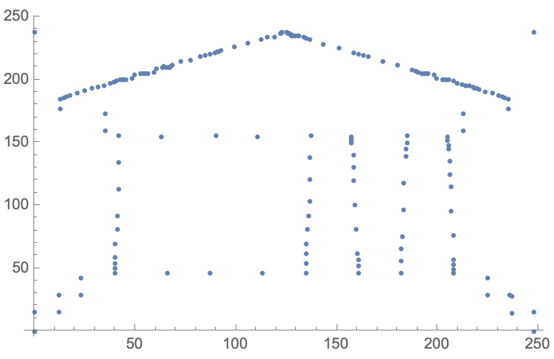
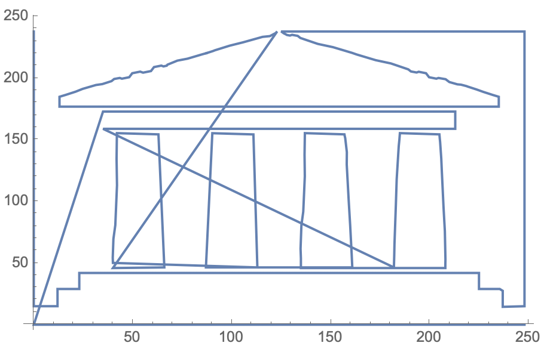

## Plotting the points

You can plot your coordinates with `ListPlot`.

--- task ---

Plot your coordinates.

```
ListPlot[points]
```



--- /task ---

This should already look a bit like a dot-to-dot!
Let's see what the solution looks like by joining all of the dots up.

--- task ---

Join up the coordinates in your plot with the `Joined` option.

```
ListPlot[points, Joined -> True]
```



--- /task ---

Finally, let's neaten it up a bit.

--- task ---

Remove the axes and (if the dot-to-dot is looking distorted) correct the aspect ratio.

```
ListPlot[points, Joined -> True, Axes -> False, AspectRatio -> 1]
```


--- /task ---


It's not perfect, but its probably not bad either!