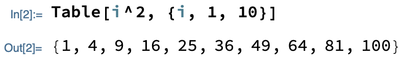

## Adding labels

You are now going to label each point in the plot by its position in the `points` list.
This will tell the person doing your dot-to-dot the order in which to connect the dots.

Labelling a point can be done with `Callout`.

--- task ---

Use `Part` to extract the first point from the `points` list.
Use `Callout` to label the point by its position and plot the result.

```
ListPlot[
    Callout[<first point>, <label>],
    Joined -> True,
    Axes -> False,
    AspectRatio -> 1
]
```

--- hints ---

--- hint ---

The first point can be extracted with `Part[points, 1]`.

--- /hint ---

--- hint ---

The position of the first point is `1`.

--- /hint ---

--- /hints ---

--- /task ---

That was **one** point. How do you label **every** point?

First, let's see what such a list of labelled points would look like:


As you can see, there's a lot of repetition: `Callout` is used over and over; the position of each point is the same as its label.
Repetitive lists like this can be made with `Table`.

--- collapse ---
---
title: Table explained
---

`Table` is a way of repeating something lots of times.
It requires two pieces of information: the thing you wish to repeat and the way in which you wish to repeat it.

In its simplest form, `Table` copies an object a number of times.
For example, this code produces 10 copies of `x`:


Where `Table` really shines is when the thing being repeated is an expression.
For example, this code evaluates `i^2` for `i` going from 1 to 10:



The range used can be very specific.
For example, this code evaluates `i^2` for `i` going from 31 to 43:


You can change the step size, too.
For example, this code evaluates `i^2` for `i` going from 5 to 3 in steps of -0.2:


--- /collapse ---

--- task ---

Use `Table` to construct a list of labelled points.

```
Table[
    Callout[
        <point>,
        <label>
    ],
    {<position>, 1, <length of list of points>}
]
```

--- hints ---

--- hint ---

`Callout` is the expression you are trying to repeat.
It needs to be an expression of some variable. We suggest calling the variable `position`.

This variable will appear three times in the code:
+ representing the position of a point (in the `points` list)
+ as the label of a point
+ in the table's range

--- /hint ---

--- hint ---

Here is the `Callout` code you need:

```
Callout[
    Part[points, position],
    position
]
```

--- /hint ---

--- hint ---

Use `Length` to find the length of the `points` list.

--- /hint ---

--- hint ---

Here is the full code:

```
Table[
    Callout[
        Part[points, position],
        position
    ],
    {position, 1, Length[points], 1}
]
```

--- /hint ---

--- /hints ---

--- /task ---

Now that all of your points are labelled, you can plot them.

--- task ---

Plot the table of points.

--- /task ---


Congratulations! You have made your very own dot-to-dot.