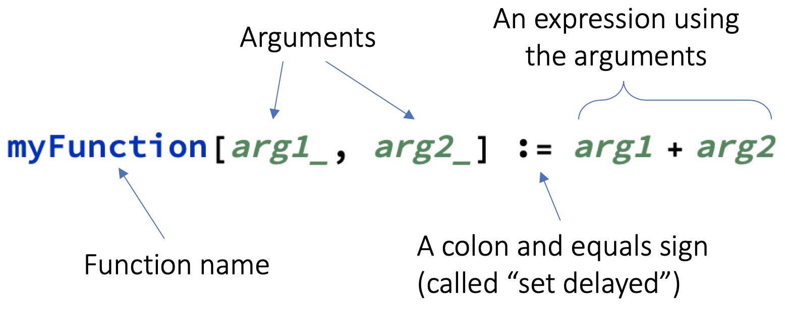

## Creating a function

So far you have created a dot-to-dot for a single image. What about other images?
Rather than repeating the whole process for every new image, you can create a function that does it for you.

--- collapse ---
---
title: Custom functions explained
---

The Wolfram Language is made up of thousands of functions, each of which is able to perform a small number of actions. (You have already used several built-in functions: `Rasterize`, `Part`, `Table`, etc.)

However, there isn't a function for everything. If there's a particular action you want to carry out, but no existing function for it, you can create your own.
Having your own function is especially convenient if you want to carry out an action multiple times.

Here's an example of a basic function which adds two numbers together:



**Important notes:**
+ The arguments inside the square brackets must be followed by underscores (`_`)
+ You must use `:=` (`SetDelayed`), not just `=` (`Set`)
+ Begin your function name with lowercase letter so as not to confuse it with a built-in function
+ You must evaluate your function before it can be applied

--- task ---

This function capitalises all of the words in a sentence, then makes them italic.

```
wordStyler[words_] := Style[Capitalize[words, "AllWords"], Italic]
```

Apply the function to the sentence "the quick brown fox jumps over the lazy dog".

--- hints ---

--- hint ---

Remember to evaluate the function before applying it.
Here is the code you need:

```
wordStyler["the quick brown fox jumps over the lazy dog"]
```

--- /hint ---

--- /hints ---

--- /task ---

--- task ---

This function puts a frame around an expression a given number of times.

```
nestedFrame[expression_, number_] := Nest[Framed, expression, number]
```

Apply the function to `x` five times.

--- hints ---

--- hint ---

Remember to evaluate the function before applying it.
Here is the code you need:

```
nestedFrame[x, 5]
```

--- /hint ---

--- /hints ---

--- /task ---

--- /collapse ---

--- task ---

Create a function that creates a dot-to-dot for any starting image.
It should have the option to show or hide the solution with `True` or `False`.

Here's a template to start off your function:

```
dotToDot[image_, solution_] :=
With[
    {
        <list of points in image>
    },
    <list plot of points>
]
```

--- hints ---

--- hint ---

The list of points can be computed as follows:

```
points = Part[ImageGraphics[image, 2, ImageSize -> 300], 1, 1]
```

--- /hint ---

--- hint ---

The list plot can be created as follows:

```
ListPlot[
    Table[
        Callout[
            Part[points, position],
            position
        ],
        {position, 1, Length[points], 1}
    ],
    Joined -> solution,
    AspectRatio -> 1,
    Axes -> False
]
```

--- /hint ---

--- /hints ---

--- /task ---

Now that you have a function, you can apply it.

--- task ---

Apply your function to a new image.
Remember, your image should be fairly simple, with just one or two block colours.

If you want to, evaluate the following code to get an example image.

```
CloudGet["https://www.wolframcloud.com/obj/RasPi/NumberThree"]
```

--- hints ---

--- hint ---

Here's an example in which the solution is not shown:

```
three = CloudGet["https://www.wolframcloud.com/obj/RasPi/NumberThree"];

dotToDot[three, False]
```

--- /hint ---

--- /hints ---