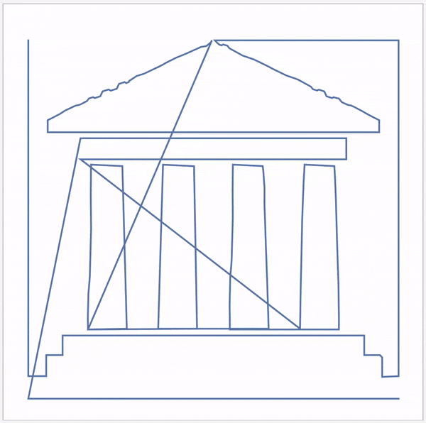

## Challenge: improve your dot-to-dot

There are several improvements that can be made to your dot-to-dot.

+ Simplify the starting image to get a cleaner result
+ Join the last dot back to the first
+ Make **all** of the labels visible
+ (Advanced) Make the dot-to-dot use a smaller number of points
+ (Advanced) Reorder, add, replace or remove points to achieve a cleaner result

--- hints ---

--- hint ---

The starting image can be simplified with `Blur`, `Rasterize` or `Binarize`.

--- /hint ---

--- hint ---

Use `Part` to find the last point (see the advanced tips in "Explaining Part").
This point can be added to the others with `Join`.

--- /hint ---

--- hint ---

Show all of the labels with the `LabelVisibility` option of `Callout`.

--- /hint ---

--- hint ---

Use `ArrayResample[<points>, <number>]` to create a shorter list of points.
The current number of points can be found with `Length`.

--- /hint ---

--- hint ---

You can use:
+ `Part` to reorder points (see the advanced tips in "Explaining Part").
+ `Join` or `Insert` to add points.
+ `ReplacePart` (or `Part`) to replace points.
+ `Delete` (or `Part`) to remove points.

Warning: this is a manual process!

--- /hint ---

--- /hints ---

